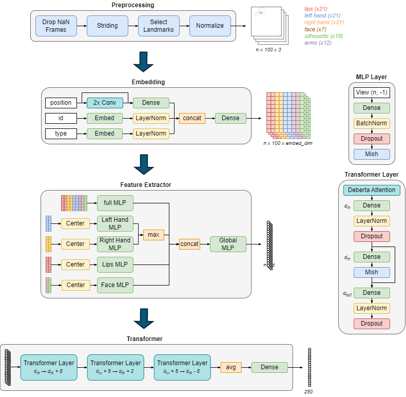
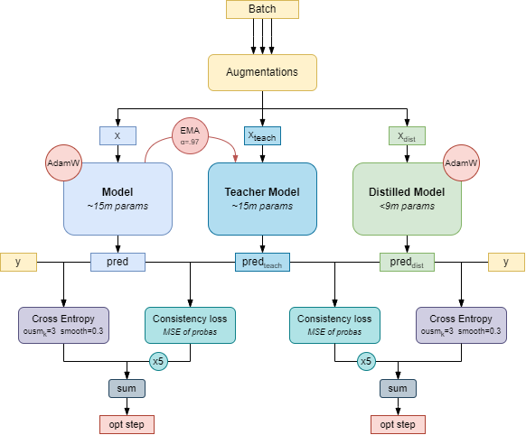

# 6th place solution to the Google - Isolated Sign Language Recognition Competition

**Authors :** [Theo Viel](https://github.com/TheoViel), [Christof Henkel](https://github.com/ChristofHenkel)

## Introduction - Adapted from [Kaggle](https://www.kaggle.com/competitions/asl-signs/discussion/406537)

Our solution is a 2 model ensemble of a MLP-encoder-frame-transformer model. We pushed our transformer models close to the limit and implemented a lot of tricks to climb up to 6th place. 

### Preprocessing & Model 



#### Preprocessing
- Remove frames without fingers
- Stride the sequence (use 1 every n frames) such that the sequence size is `<= max_len`. We used `max_len=25` and `80` in the final ensemble
- Normalization is done for the whole sequence to have 0 mean and 1 std. We do an extra centering before the specific MLP. Nan values are set to 0

#### Embedding
- 2x 1D convolutions (`k=5`) to smooth the positions
- Embed the landmark id and type (e.g. lips, right hand, ...), `embed_dim=dense_dim=16`

#### Feature extractor
- One MLP combining all the features, and 4 for specific landmark types (2x hands, face, lips)
- Max aggregation for hands is to take into account that signers use one hand
- `dim=192`, `dropout=0.25`

#### Transformer
- Deberta was better than Bert, but we had to rewrite the attention layer for it to be efficient
- To reduce the number of parameters, we use a smaller first transformer, and modify the output layer to upscale/downscale the features. This was key to enable blending 2 models
- `d_in=512`, `δ=256` for `max_len=25`, `δ=64` for `max_len=80`, `num_heads=16`, `dropout=0.05` for the first layer, `0.1` for the other 2
- Unfortunately, we did not have any luck with using a pre-trained version of Deberta, for example by importing some of the pretrained weights

 
### Training strategy



#### Augmentations:
- Horizontal Flip (`p=0.5`)
- Rotate around `(0, 0, 0)` by an angle between -60 and 60°  (`p=0.5`)
- Resizing by a factor in `(0.7, 1.3)` (`p=0.5`). We also allow for distortion (`p=0.5`)
- Crop 20% of the start or end (`p=0.5`)
- Interpolate to fill missing values (`p=0.5`)
- Manifold Mixup [[1]](https://arxiv.org/abs/1806.05236) (scheduled, `p=0.5 * epoch / (0.9 * n_epochs)`) : random apply mixup to the features before one of the transformer layer
- Only during the first half of the training, since it improved convergence
  - Fill the value of the missing hand with those of the existing one (`p=0.25`)
  - Face CutMix : replace the face landmarks with those of another signer doing the same sign (`p=0.25`)

#### Training
- 100 epochs, `lr=3e-4`, 25% warmup, linear schedule
- Cross entropy with smoothing (`eps=0.3`)
- `weight_decay=0.4`, `batch_size=32` (x8 GPUs)
- OUSM [[2]](https://arxiv.org/pdf/1901.07759.pdf), i.e. exclude the top k (`k=3`) samples with the highest loss from the computation
- Mean teacher [[3]](https://arxiv.org/abs/1703.01780) & Knowledge Distillation (see image above). We train 3 models at the same time, and use the distilled one for inference
- Model soup [[4]](https://arxiv.org/abs/2203.05482) of the last 10 epochs checkpoints


## How to use the repository

### Prerequisites

- Clone the repository
- Requirements :
  - `pip install -r requirements.txt`
  - Bunch of stuff that doesn't really matter that much

- Download the data :
  - Put the competition data from [Kaggle](https://www.kaggle.com/competitions/asl-signs/data) in the `input` folder


### Run The pipeline

#### Data preparation

Prepare the data using `Preparation_torch.ipynb`. For our best submissions, we used `max_len=25` (folder name is `torch_12`) and `max_len=80` (folder name is `torch_18`).

#### Training

Train models using `train_ddp.sh`, specify the config in the `src/main.py` file. We used 8x V100 but training can be done on lower-end GPUs.

You can keep the parameters in the `Config` class as-is. To reproduce our best submissions, use the following parameters :
  - `max_len = 25` -> `dense_dim = 512`, `transfo_dim = 1536`, `distill_transfo_dim=768`
  - `max_len = 80` -> `dense_dim = 256`, `transfo_dim = 1024`, `distill_transfo_dim=576`

We provide model configs, weights and predictions in the `logs` folder.

#### Evaluation & inference

Evaluate your models using `Validation.ipynb`. The second part of the notebook runs the inference on the validation data, and is used to evaluate distilled models with (or without) model soup. Conversion of the models to tflite is done using `Inference_Ens.ipynb`. 


## Code structure

If you wish to dive into the code, the repository naming should be straight-forward. Each function is documented.
The structure is the following :

```
src
├── data
│   ├── dataset.py              # Dataset class
│   ├── loader.py               # Dataloader
│   ├── preparation.py          # Data preparation
│   └── transforms.py           # Augmentations
├── inference           
│   ├── main.py                 # Main file
│   └── predict.py              # Predict function
├── model_zoo 
│   └── models.py               # Model
├── tflite                        
│   ├── deberta.py              # Custom deberta for efficient inference
│   ├── models.py               # Model for tflite conversion
│   └── prepro.py               # Preprocessing in Tensorflow
├── training      
│   ├── losses.py               # Loss functions
│   ├── main.py                 # k-fold main
│   ├── optim.py                # Model optimization
│   └── train.py                # Training functions
├── utils
│   ├── logger.py               # Logging utils
│   ├── metrics.py              # Metrics for the competition
│   ├── plot.py                 # Plotting utils
│   └── torch.py                # Torch utils
├── main.py                     # Training script
└── params.py                   # Main parameters
``` 
